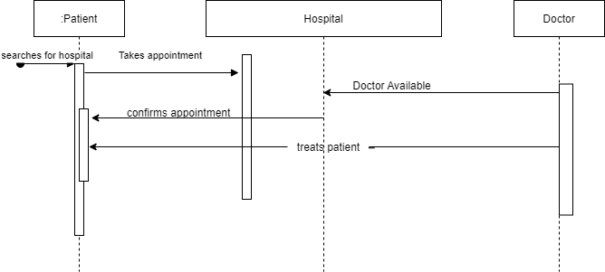

# hospital management

This application can be used for managing, maintaining an updating the details of patients of the hospital.

This application just runs crud operations over the records saved in memory.

## Functionalities

1. Create the data for person/ patients.

2. View the data of the patients by clicking the name field of the table.

3. Update the details with similar validations as create functionality has.

4. Delete the record of the person/patient.

5. it also helps to manipulate the data of the person

## Class Diagram

## Sequence Diagram
